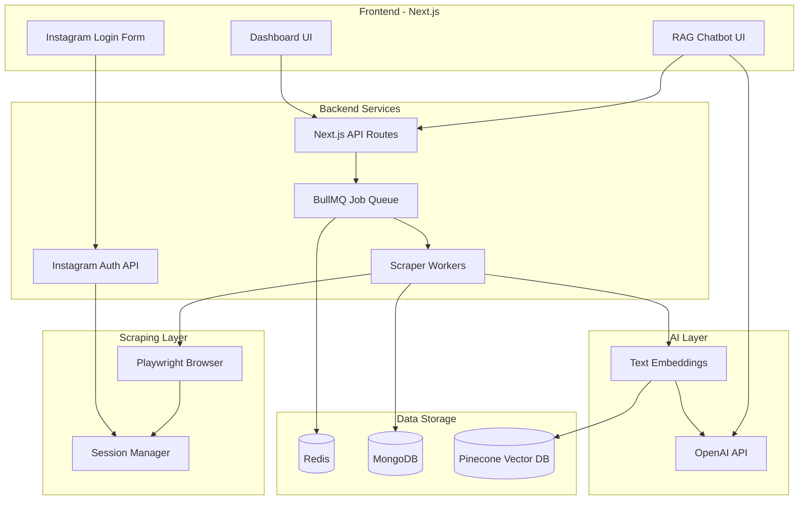
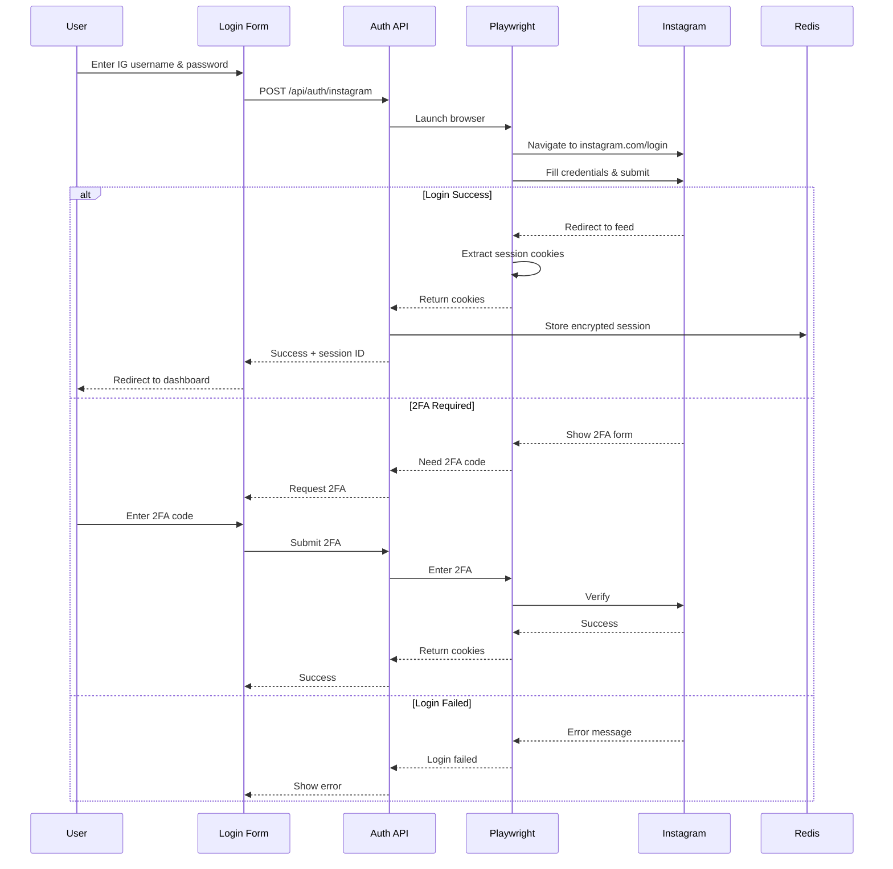

# Instagram Scraper RAG Web Application

## Architecture Overview



## Tech Stack

| Layer | Technology |

|-------|------------|

| Frontend | Next.js 14 (App Router), Tailwind CSS, shadcn/ui |

| Backend | Next.js API Routes, BullMQ |

| Scraping | Playwright |

| Queue/Cache | Redis |

| Database | MongoDB (Mongoose) |

| Vector DB | Pinecone (free tier available) |

| AI/LLM | OpenAI GPT-4 + text-embedding-3-small |

| Session | Encrypted cookies untuk Instagram session |

## Instagram Login Flow (NEW)



## Database Schema (MongoDB)

```javascript
// InstagramSession Collection (NEW)
{
  _id: ObjectId,
  sessionId: String, // UUID
  username: String,
  cookies: String, // Encrypted
  userAgent: String,
  createdAt: Date,
  lastUsedAt: Date,
  isValid: Boolean
}

// Profile Collection
{
  _id: ObjectId,
  username: String,
  fullName: String,
  bio: String,
  profilePicUrl: String,
  followersCount: Number,
  followingCount: Number,
  postsCount: Number,
  isPrivate: Boolean,
  scrapedAt: Date,
  scrapedDepth: Number,
  parentUsername: String,
  sessionId: String, // Link ke session yang digunakan
  interests: [String],
  niche: String
}

// Posts Collection  
{
  _id: ObjectId,
  profileId: ObjectId,
  postId: String,
  caption: String,
  imageUrl: String,
  likesCount: Number,
  commentsCount: Number,
  postedAt: Date,
  type: "post" | "reel"
}

// ScrapeJob Collection
{
  _id: ObjectId,
  sessionId: String, // Session yang digunakan untuk scrape
  entryUsername: String,
  status: "pending" | "processing" | "completed" | "failed",
  maxDepth: Number,
  currentDepth: Number,
  totalProfiles: Number,
  processedProfiles: Number,
  startedAt: Date,
  completedAt: Date
}
```

## Project Structure

```
instagram-scrapper-rag/
├── src/
│   ├── app/
│   │   ├── page.tsx                 # Landing/Login page
│   │   ├── dashboard/page.tsx       # Dashboard (protected)
│   │   ├── chat/page.tsx            # RAG Chatbot
│   │   ├── jobs/page.tsx            # Job monitoring
│   │   ├── profiles/page.tsx        # Scraped profiles
│   │   └── api/
│   │       ├── auth/
│   │       │   ├── instagram/route.ts    # Instagram login
│   │       │   ├── verify-2fa/route.ts   # 2FA verification
│   │       │   ├── session/route.ts      # Check session
│   │       │   └── logout/route.ts       # Logout/clear session
│   │       ├── scrape/route.ts      # Start scrape
│   │       ├── jobs/route.ts        # Job status
│   │       ├── profiles/route.ts    # Get profiles
│   │       └── chat/route.ts        # RAG chat endpoint
│   ├── components/
│   │   ├── ui/                      # shadcn components
│   │   ├── auth/
│   │   │   ├── LoginForm.tsx        # Instagram login form
│   │   │   └── TwoFactorModal.tsx   # 2FA input modal
│   │   ├── dashboard/
│   │   ├── chat/
│   │   └── profiles/
│   ├── lib/
│   │   ├── db/
│   │   │   ├── mongodb.ts
│   │   │   └── models/
│   │   │       ├── Session.ts       # Instagram session model
│   │   │       ├── Profile.ts
│   │   │       ├── Post.ts
│   │   │       └── Job.ts
│   │   ├── queue/
│   │   │   ├── redis.ts
│   │   │   ├── scrapeQueue.ts
│   │   │   └── worker.ts
│   │   ├── scraper/
│   │   │   ├── instagram.ts         # Playwright scraper
│   │   │   ├── auth.ts              # Instagram authentication
│   │   │   ├── session.ts           # Session management
│   │   │   └── parser.ts
│   │   ├── ai/
│   │   │   ├── openai.ts
│   │   │   ├── embeddings.ts
│   │   │   └── rag.ts
│   │   ├── pinecone/
│   │   │   └── client.ts
│   │   └── utils/
│   │       └── encryption.ts        # Encrypt/decrypt credentials
│   └── types/
│       └── index.ts
├── workers/
│   └── scrapeWorker.ts
├── .env.local
├── docker-compose.yml
└── package.json
```

## Login Form UI Design

```
┌─────────────────────────────────────────────────────────────┐
│                                                             │
│                    🔍 Instagram Scraper                     │
│                                                             │
│   ┌─────────────────────────────────────────────────────┐   │
│   │                                                     │   │
│   │   Login dengan akun Instagram Anda                  │   │
│   │                                                     │   │
│   │   ┌─────────────────────────────────────────────┐   │   │
│   │   │  📧 Username atau Email                     │   │   │
│   │   └─────────────────────────────────────────────┘   │   │
│   │                                                     │   │
│   │   ┌─────────────────────────────────────────────┐   │   │
│   │   │  🔒 Password                        👁       │   │   │
│   │   └─────────────────────────────────────────────┘   │   │
│   │                                                     │   │
│   │   ☑️ Ingat sesi saya                                │   │
│   │                                                     │   │
│   │   ┌─────────────────────────────────────────────┐   │   │
│   │   │              🔐 Login                        │   │   │
│   │   └─────────────────────────────────────────────┘   │   │
│   │                                                     │   │
│   │   ⚠️ Credentials disimpan terenkripsi dan hanya    │   │
│   │      digunakan untuk scraping                      │   │
│   │                                                     │   │
│   └─────────────────────────────────────────────────────┘   │
│                                                             │
└─────────────────────────────────────────────────────────────┘
```

## Security Considerations

1. **Password Encryption**: Credentials dienkripsi menggunakan AES-256-GCM sebelum disimpan
2. **Session Storage**: Cookies Instagram disimpan terenkripsi di Redis dengan TTL
3. **No Plain Text**: Password tidak pernah disimpan dalam plain text
4. **HTTPS Only**: Wajib menggunakan HTTPS di production
5. **Session Validation**: Validasi session sebelum setiap scrape operation

## Implementation Phases

### Phase 1: Project Setup dan Infrastructure

- Initialize Next.js 14 dengan App Router
- Setup Tailwind CSS dan shadcn/ui
- Configure MongoDB connection dengan Mongoose
- Setup Redis dan BullMQ
- Create Docker Compose untuk Redis + MongoDB

### Phase 2: Instagram Authentication (NEW)

- Build login form UI dengan username/password input
- Implement Playwright-based Instagram login
- Handle 2FA authentication flow
- Session encryption dan storage di Redis
- Session validation dan refresh logic

### Phase 3: Instagram Scraper Core

- Implement Playwright-based scraper dengan session reuse
- Scrape profile info, followers, following
- Scrape posts dan reels dengan captions
- Rate limiting dan delay handling
- Error handling dan retry mechanism

### Phase 4: Job Queue System

- BullMQ queue setup untuk scrape jobs
- Worker implementation dengan chaining logic
- Job progress tracking
- Depth control untuk chaining
- Concurrent job limiting

### Phase 5: AI dan RAG Integration

- OpenAI client setup
- Generate embeddings dari profile bio + post captions
- Pinecone vector storage
- Interest dan niche analysis menggunakan GPT
- RAG retrieval logic

### Phase 6: Frontend Dashboard

- Protected routes (require login)
- Dashboard dengan scrape controls
- Job monitoring dengan progress bar
- Profile browser dengan search dan filter
- RAG Chatbot interface
- Real-time updates via polling/SSE

### Phase 7: Optimization dan Polish

- Caching layer
- Pagination untuk large datasets
- Export functionality (CSV/JSON)
- Error monitoring
- UI polish

## Environment Variables Required

```env
# MongoDB
MONGODB_URI=mongodb://localhost:27017/instagram-scraper

# Redis
REDIS_URL=redis://localhost:6379

# Encryption (untuk credentials)
ENCRYPTION_KEY=your-32-byte-encryption-key-here

# OpenAI
OPENAI_API_KEY=sk-...

# Pinecone
PINECONE_API_KEY=...
PINECONE_INDEX=instagram-profiles

# App
NEXT_PUBLIC_APP_URL=http://localhost:3000
NODE_ENV=development
```

## API Endpoints

| Endpoint | Method | Description |

|----------|--------|-------------|

| `/api/auth/instagram` | POST | Login dengan username/password |

| `/api/auth/verify-2fa` | POST | Verifikasi kode 2FA |

| `/api/auth/session` | GET | Cek status session |

| `/api/auth/logout` | POST | Logout dan hapus session |

| `/api/scrape` | POST | Mulai scrape job baru |

| `/api/jobs` | GET | List semua jobs |

| `/api/jobs/[id]` | GET | Detail job tertentu |

| `/api/profiles` | GET | List profiles yang sudah di-scrape |

| `/api/chat` | POST | RAG chatbot endpoint |

## Estimated Timeline

- Phase 1: 1-2 hari
- Phase 2: 2-3 hari (Instagram auth kompleks)
- Phase 3: 3-4 hari
- Phase 4: 2-3 hari
- Phase 5: 2-3 hari
- Phase 6: 3-4 hari
- Phase 7: 1-2 hari

**Total: ~2.5-3 minggu untuk MVP**